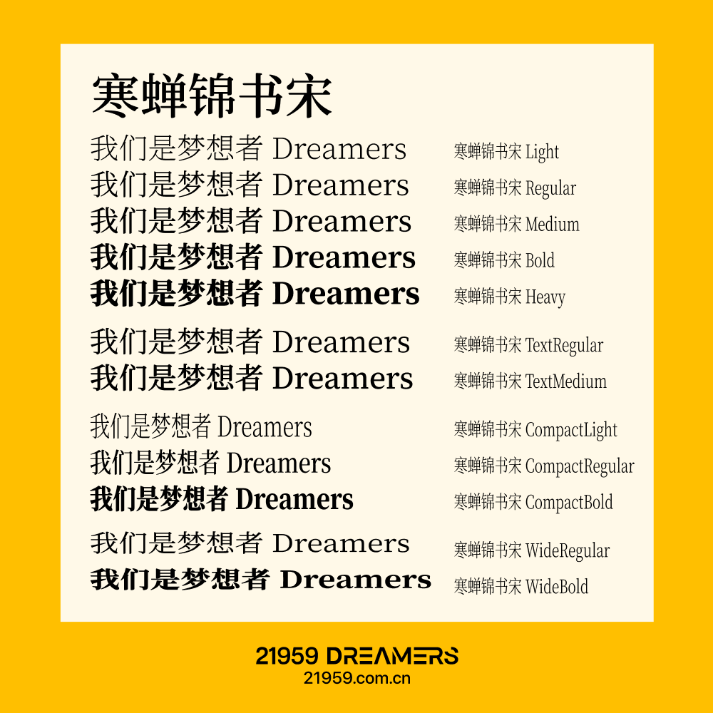

## 字体规范 | Font Specification

此项目包含了 **寒蝉锦书宋** 字体，提供多种风格和字重，适用于不同的设计需求。下图展示了字体的各种风格，从 Light 到 Heavy，并包括 Text、Compact 和 Wide 的变体，以便于在品牌材料中保持一致的字体使用。

    
    

### 下载选项 | Download Options

您可以通过以下方式下载 **寒蝉锦书宋** 字体：
- [从原始 ChillJinshuSong GitHub 仓库下载](https://github.com/Warren2060/ChillJinshuSong)
- **推荐：**[链接一键下载](https://assets.zigao.wang/img/%E5%AF%92%E8%9D%89%E9%94%A6%E4%B9%A6%E5%AE%8BGB.zip)

### 字体风格和字重 | Font Styles and Weights

此字体包含以下风格：
- **Light、Regular、Medium、Bold、Heavy**
- **Text Regular、Text Medium**
- **Compact Light、Compact Regular、Compact Bold**
- **Wide Regular、Wide Bold**

每种风格提供独特的字重和设计，适用于不同的品牌和设计环境。

---

如需了解更多关于字体风格的使用，欢迎访问 [ChillJinshuSong GitHub 仓库](https://github.com/Warren2060/ChillJinshuSong)。
